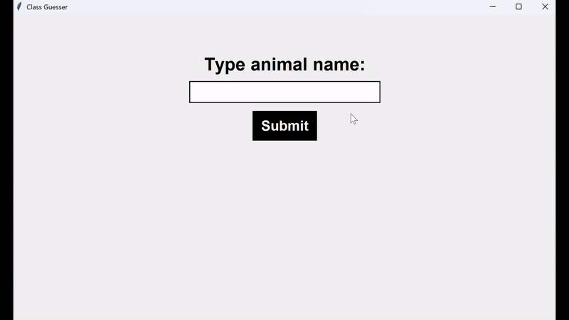

# Animal recognition and class classification

The goal of this project is to analyze a dataset of zoo animals. \
The project consists of two main components:  

1. **Classification Models** – These models aim to classify animals into their respective classes.  
2. **Akinator-Style Program** – An interactive application that asks the user a series of questions and attempts to determine the specific animal they are thinking of.

## About the dataset
This dataset consists of 101 animals from a zoo.\
There are 16 variables with various traits to describe the animals.\
The 7 Class Types are: Mammal, Bird, Reptile, Fish, Amphibian, Bug and Invertebrate.

Attribute Information: (name of attribute and type of value domain)
- animal_name (Unique for each instance)
- hair (Boolean)
- feathers (Boolean)
- eggs (Boolean)
- milk (Boolean)
- airborne (Boolean)
- aquatic (Boolean)
- predator (Boolean)
- toothed (Boolean)
- backbone (Boolean)
- breathes (Boolean)
- venomous (Boolean)
- fins (Boolean)
- legs Numeric (set of values: {0,2,4,5,6,8})
- tail (Boolean)
- domestic (Boolean)
- catsize (Boolean)
- class_type Numeric (integer values in range [1,7])


## How to run this project

### Setting up virtual environment and installing requirements

After cloning the repository set up virtual environment and install requirements

```
python -m venv venv 
source venv/bin/activate
pip install -r requirements.txt
```

### Runing the project using DVC

This project uses DVC (Data Version Control) to run data processing pipelines.

Run the "evaluate_model" stage to see performance of the best model
```
dvc repro evaluate_model
```

To see the accuracy of the best model run
```
dvc accuracy show
dvc plots show
```

### Seeing the results

To see the results of the ML-pipeline run the following commands:
```
dvc metrics show
dvc plots show
```

## About the models
| Model              | Description                                                                                     |
|--------------------|-------------------------------------------------------------------------------------------------|
| K-means            | A clustering algorithm that partitions data into K distinct clusters based on feature similarity. It minimizes the variance within each cluster. K-means is an unsupervised learning algorithm, meaning it doesn’t use labeled data for training, just grouping data into clusters based on similarity without knowing the true labels. That can reault in lower accuracy in comparison to supervised models.|
| kNN (k-Nearest Neighbors) | A non-parametric classifier that assigns a label to a data point based on the majority class of its k closest neighbors.|
| Decision Tree      | A tree-like model that splits data into branches based on feature values, making decisions by following the paths of the tree. The model can overfit. |
| Random Forest      | An ensemble learning method that constructs multiple decision trees and combines their predictions. It helps reduce overfitting and improves accuracy. |
| Gradient Boosting  | An ensemble method that builds decision trees sequentially, each one correcting the errors of its predecessor, optimizing a loss function to improve predictive performance. |
| SVC (Support Vector Classifier) | A supervised learning model that finds the hyperplane that best separates data into different classes. |


## About Animal Guesser app

The application is designed to identify the name of an animal based on a series of questions. The user is to think of an animal (existing in the dataset) and answer the questions accurately. After several questions, the program will provide a final prediction or, if multiple animals have identical characteristics, it will return a list of possible candidates.

### How to use Animal Guesser app

Run Animal_Guesser_app.py


## About Class Guesser app

The application is designed to recognize the class of an animal based on the available parameters in the dataset. The best model for prediction is selected according to the 'accuracy.json' file.

### How to use Animal Class Guesser app

Run Class_Guesser_app.py


